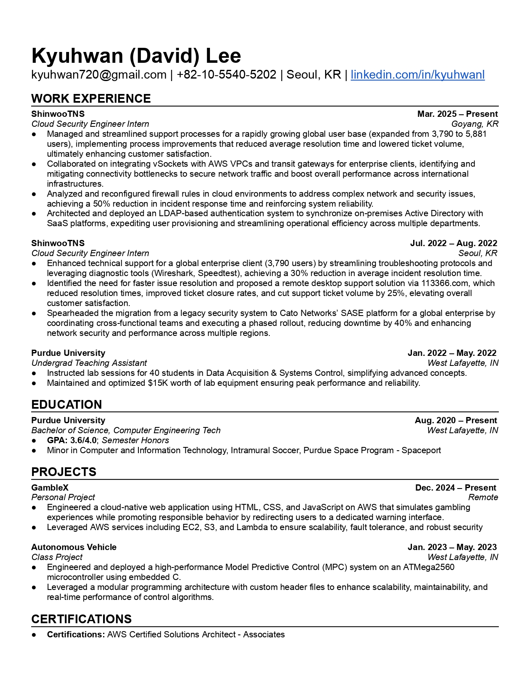

# 👋 Hi, I'm Kyuhwan

I'm a student at Purdue University, majoring in Computer Engineering Technology with a minor in Computer and Information Technology. I've also lived and studied in various cities:

- 📍 Seoul, South Korea
- 📍 Budapest, Hungary
- 📍 Sydney, Australia
- 📍 Bathurst, Australia
- 📍 Busan, South Korea
- 📍 West Lafayette, Indiana, USA
- 📍 Goyang-si, South Korea

---

## 🎓 Education

Currently pursuing my bachelor's at Purdue University.

---

## 🚀 Interests

- ☁️ Cloud Computing
- 🤖 Artificial Intelligence
- 🎵 Music
- 🎮 Gaming
- ⚽ Sports
- 🎬 Watching Movies/Netflix
- 💹 Investing (stocks, ETFs, Bitcoin)
- 📺 Watching YouTube
- 🖥️ New Technologies

---

## 🎵 Music

I listen to just about anything——except country/folk music. 

---

## 🎮 Gaming

I enjoy gaming in my spare time. Check out my [Steam profile](https://steamcommunity.com/id/davidkyuhwanlee/) and add me on Discord: `.dernie`.

---

## ⚽ Sports

I've played various sports since elementary school, including baseball, soccer, basketball, volleyball, and track and field. I also enjoy watching sports.

---

## 📄 Resume

Below is a snapshot of my resume:

There is also a [.pdf](./Kyuhwan_Lee_Resume_2025.pdf) version available!

---

## 🌐 Connect with me!

- [LinkedIn](https://www.linkedin.com/in/kyuhwanl)
- [Email](mailto:kyuhwan720@gmail.com)
